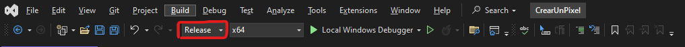

# Tutorial de la libreria OpenGL
Este es un tutorial en español para graficar por computadora utilizando la libreria de OpenGL, mas en especifico las librerias GLFW y GLEW.

Cabe aclarar que para este punto ya deben de estar configuradas las librerias correspondientes para importarlas al proyecto, sino aqui hay un [tutorial de como hacer esta configuracion](https://youtu.be/4zjCqjfjcPs?list=PLRtjMdoYXLf4yTkXgyRBy5LXTFhdU7LWq).

>PD: este tutorial esta basado en otro tuto en ingles, aca esta la liga por si quieren hecharle un vistazo igualmente: [playlist](https://youtube.com/playlist?list=PLRtjMdoYXLf4yTkXgyRBy5LXTFhdU7LWq&si=TaXtFu7hE7lGJSOQ).

>PD2: Tambien algo a destacar es que si estan en Visual Studio 2022, deben cambiar la configuracion de la solucion a ***relase*** de lo contrario les saldran errores.



>PD3: De igual modo deben añadir las siguientes lineas hasta arriba del codigo, antes de incluir las librerias, para que no marque como indefinidas algunas funciones de OpenGL.
```c++
#pragma comment(lib, "glew32s.lib")
#pragma comment(lib, "opengl32.lib")
#pragma comment(lib, "glfw3dll.lib")
```